```mermaid
flowchart TD
    %% ============================================================================
    %% PALOMA'S ORRERY - SYSTEM ARCHITECTURE FLOWCHART
    %% Version 14 - November 26, 2025
    %% Updates: Osculating cache system, orbital_elements.py, removed refined_orbits.py
    %% ============================================================================

    %% ============================================================================
    %% LAYER 1: EXTERNAL DATA SOURCES (TOP)
    %% ============================================================================
    subgraph SOURCES["🌐 EXTERNAL DATA SOURCES"]
        direction LR
        HORIZONS{{"JPL Horizons<br/>Orbits & Osculating Elements"}}
        CATALOGS{{"Stellar Catalogs<br/>Hipparcos/Gaia/SIMBAD"}}
        CLIMATE{{"Climate Data<br/>NOAA/NASA/NSIDC"}}
        MESSIER{{"Messier<br/>Catalog"}}
    end

    %% ============================================================================
    %% LAYER 2: DATA ACQUISITION
    %% ============================================================================
    subgraph ACQUIRE["📥 DATA ACQUISITION LAYER"]
        direction TB
        subgraph SOLAR_ACQ["Solar System"]
            ODM["orbit_data_manager.py<br/>fetch_orbit_path()"]
            EPHEMDB[("satellite_ephemerides.json")]
        end
        subgraph STELLAR_ACQ["Stellar Data"]
            DA["data_acquisition.py<br/>VizieR queries"]
            DAD["data_acquisition_distance.py"]
            SIMBADMGR["simbad_manager.py<br/>SIMBAD API"]
        end
        subgraph CLIMATE_ACQ["Climate Data"]
            FETCHCLIMATE["fetch_climate_data.py"]
            FETCHPALEO["fetch_paleoclimate_data.py"]
        end
        subgraph MESSIER_ACQ["Deep Sky Objects"]
            MESSDATA["messier_catalog.py"]
            MESSHANDLER["messier_object_data_handler.py"]
        end
    end

    %% ============================================================================
    %% LAYER 3: CACHE MANAGEMENT
    %% ============================================================================
    subgraph CACHE["💾 CACHE MANAGEMENT LAYER"]
        direction TB
        subgraph ORBIT_CACHE["Orbit Trajectory Cache"]
            ORBITCACHE[("orbit_cache/<br/>JSON trajectory files")]
            VERIFYORBIT["verify_orbit_cache.py<br/>repair_cache_on_load()"]
        end
        subgraph OSC_CACHE["Osculating Elements Cache ⭐"]
            OSCCACHEMGR["osculating_cache_manager.py<br/>epoch tracking, auto-refresh"]
            OSCCACHEFILE[("osculating_cache.json<br/>40+ objects, backbone of<br/>orbit visualization")]
        end
        subgraph STELLAR_CACHE["Stellar Cache"]
            VOTMGR["vot_cache_manager.py<br/>safe_load_vot()"]
            INCRCACHE["incremental_cache_manager.py<br/>smart_load_or_fetch()"]
            VOTFILES[("VOTable .vot files<br/>Pickle .pkl files")]
        end
        subgraph CLIMATE_CACHE["Climate Cache"]
            CLIMATECACHE["climate_cache_manager.py<br/>validate_climate_cache()"]
            CLIMATEDIR[("climate_cache/<br/>JSON files")]
        end
        BACKUPS["create_cache_backups.py<br/>protect_all_caches()"]
    end

    %% ============================================================================
    %% LAYER 4: DATA PROCESSING
    %% ============================================================================
    subgraph PROCESS["⚙️ DATA PROCESSING LAYER"]
        direction TB
        subgraph COORD_PROC["Coordinate Processing"]
            DP["data_processing.py<br/>calculate_cartesian_coordinates()"]
            CELESTIAL["celestial_coordinates.py<br/>RA/Dec conversions"]
        end
        subgraph STELLAR_PROC["Stellar Parameter Calculation"]
            STEL["stellar_parameters.py<br/>calculate_stellar_parameters()"]
            PATCHES["stellar_data_patches.py<br/>apply_temperature_patches()"]
            ESP["enhanced_star_properties.py"]
        end
        subgraph ORBIT_PROC["Orbital Mechanics ⭐"]
            ORBITAL_ELEM["orbital_elements.py<br/>parent_planets, planet_tilts<br/>incl. Pluto-Charon barycenter"]
            IDEALIZED["idealized_orbits.py<br/>Keplerian + osculating orbits<br/>dual-orbit system, apsidal markers"]
            INTEGRATION["orrery_integration.py<br/>OrreryConfiguration"]
            APSIDAL["apsidal_markers.py<br/>perihelion/aphelion<br/>perturbation analysis"]
        end
        subgraph ANALYSIS["Analysis & Classification"]
            OBJANALYZER["object_type_analyzer.py<br/>analyze_distribution()"]
            CS["catalog_selection.py<br/>select_stars()"]
        end
    end

    %% ============================================================================
    %% LAYER 5: VISUALIZATION PREPARATION
    %% ============================================================================
    subgraph VIZPREP["🎨 VISUALIZATION PREPARATION"]
        direction TB
        subgraph SOLAR_PREP["Solar System Visualization"]
            PLANVIZ["planet_visualization.py<br/>create_planet_visualization()"]
            PLANUTIL["planet_visualization_utilities.py"]
            HELPERS["palomas_orrery_helpers.py"]
        end
        subgraph STELLAR_PREP["Stellar Visualization"]
            VIZ3D["visualization_3d.py<br/>prepare_3d_data()"]
            VIZ2D["visualization_2d.py<br/>prepare_2d_data()"]
            VIZCORE["visualization_core.py<br/>common utilities"]
        end
        subgraph SHELLS["Planetary Interior Shells"]
            SHELLS_GROUP["12 shell modules:<br/>solar, mercury, venus, earth,<br/>mars, jupiter, saturn, uranus,<br/>neptune, pluto, eris, planet9"]
            ASTEROID_COMET["asteroid_belt, comet<br/>visualization shells"]
        end
        subgraph EXOPLANET_PREP["Exoplanet Systems"]
            EXOSYS["exoplanet_systems.py"]
            EXOORB["exoplanet_orbits.py"]
            EXOCOORD["exoplanet_coordinates.py"]
            EXOSTELL["exoplanet_stellar_properties.py"]
        end
    end

    %% ============================================================================
    %% LAYER 6: USER INTERFACE & CONTROLS
    %% ============================================================================
    subgraph GUI["🖥️ USER INTERFACE LAYER"]
        direction TB
        subgraph MAIN_GUI["Main Application"]
            ORRERY["palomas_orrery.py<br/>Main GUI (404KB, 8,400+ lines)<br/>plot_objects(), animate_objects()<br/>Pluto-Charon barycenter mode"]
        end
        subgraph SPECIALIZED_GUI["Specialized Visualizations"]
            STARGUI["star_visualization_gui.py<br/>HR diagrams & stellar neighborhood"]
            EARTHGUI["earth_system_visualization_gui.py<br/>Climate data hub (9 visualizations)"]
            ORBVIZ["orbital_param_viz.py<br/>Orbital mechanics education"]
        end
        subgraph HR_VARIANTS["HR Diagram Variants"]
            HRD["hr_diagram_distance.py"]
            HRM["hr_diagram_apparent_magnitude.py"]
            PD["planetarium_distance.py"]
            PM["planetarium_apparent_magnitude.py"]
        end
        subgraph CLIMATE_VIZ["Climate Visualizations"]
            PALEOFULL["paleoclimate_visualization_full.py"]
            PALEODUAL["paleoclimate_dual_scale.py"]
        end
    end

    %% ============================================================================
    %% LAYER 7: REPORTING & DATA EXCHANGE
    %% ============================================================================
    subgraph REPORT["📊 REPORTING & DATA EXCHANGE"]
        direction LR
        PLOTEXCHANGE["plot_data_exchange.py<br/>save/load_plot_data()"]
        REPORTMGR["report_manager.py<br/>generate_report()"]
        PLOTREPORT["plot_data_report_widget.py<br/>statistical summaries"]
    end

    %% ============================================================================
    %% LAYER 8: UTILITIES & SUPPORT
    %% ============================================================================
    subgraph UTILS["🔧 UTILITIES & SUPPORT"]
        direction LR
        SAVE["save_utils.py<br/>save_plot()"]
        FORMAT["formatting_utils.py<br/>format_hover_text()"]
        SHARED["shared_utilities.py<br/>ScrollableFrame, ToolTip"]
        SHUTDOWN["shutdown_handler.py<br/>cleanup"]
        VIZUTIL["visualization_utils.py"]
    end

    %% ============================================================================
    %% LAYER 9: CONFIGURATION & CONSTANTS
    %% ============================================================================
    subgraph CONFIG["📋 CONFIGURATION & CONSTANTS"]
        direction LR
        CONSTANTS["constants_new.py<br/>(174KB comprehensive)<br/>orbital parameters, physical constants"]
        STARNOTES["star_notes.py<br/>unique_notes dictionary"]
    end

    %% ============================================================================
    %% LAYER 10: FINAL OUTPUTS (BOTTOM)
    %% ============================================================================
    subgraph OUTPUTS["📁 FINAL OUTPUTS"]
        direction LR
        PLOTS[/"PNG & HTML<br/>plot files"/]
        DATA[/"JSON data files<br/>last_plot_data.json"/]
        REPORTS[/"Plot reports<br/>reports/ directory"/]
        CACHES[/"Cache directories<br/>orbit_cache/, climate_cache/"/]
    end

    %% ============================================================================
    %% VERTICAL FLOW CONNECTIONS (TOP TO BOTTOM)
    %% ============================================================================
    
    %% Sources to Acquisition
    HORIZONS --> SOLAR_ACQ
    HORIZONS --> OSC_CACHE
    CATALOGS --> STELLAR_ACQ
    CLIMATE --> CLIMATE_ACQ
    MESSIER --> MESSIER_ACQ
    
    %% Acquisition to Cache
    SOLAR_ACQ --> ORBIT_CACHE
    STELLAR_ACQ --> STELLAR_CACHE
    CLIMATE_ACQ --> CLIMATE_CACHE
    MESSIER_ACQ --> PROCESS
    
    %% Cache to Processing
    ORBIT_CACHE --> ORBIT_PROC
    OSC_CACHE --> ORBIT_PROC
    STELLAR_CACHE --> STELLAR_PROC
    STELLAR_CACHE --> COORD_PROC
    CLIMATE_CACHE --> GUI
    
    %% Cache Management Layer
    BACKUPS -.-> ORBIT_CACHE
    BACKUPS -.-> STELLAR_CACHE
    BACKUPS -.-> CLIMATE_CACHE
    BACKUPS -.-> OSC_CACHE
    
    %% Processing to Visualization Prep
    COORD_PROC --> SOLAR_PREP
    COORD_PROC --> STELLAR_PREP
    STELLAR_PROC --> STELLAR_PREP
    ORBIT_PROC --> SOLAR_PREP
    ORBIT_PROC --> SHELLS
    ANALYSIS --> STELLAR_PREP
    
    %% Visualization Prep to GUI
    SOLAR_PREP --> MAIN_GUI
    STELLAR_PREP --> SPECIALIZED_GUI
    SHELLS --> MAIN_GUI
    EXOPLANET_PREP --> MAIN_GUI
    
    %% GUI to Outputs
    MAIN_GUI --> REPORT
    SPECIALIZED_GUI --> REPORT
    HR_VARIANTS --> REPORT
    CLIMATE_VIZ --> REPORT
    
    %% Reporting to Outputs
    REPORT --> OUTPUTS
    
    %% Utilities support all layers
    CONFIG -.-> PROCESS
    CONFIG -.-> VIZPREP
    CONFIG -.-> GUI
    UTILS -.-> VIZPREP
    UTILS -.-> GUI
    UTILS -.-> OUTPUTS

    %% ============================================================================
    %% STYLING
    %% ============================================================================
    classDef sourceStyle fill:#e1f5ff,stroke:#0077be,stroke-width:2px
    classDef acquireStyle fill:#fff4e6,stroke:#ff9800,stroke-width:2px
    classDef cacheStyle fill:#f3e5f5,stroke:#9c27b0,stroke-width:2px
    classDef processStyle fill:#e8f5e9,stroke:#4caf50,stroke-width:2px
    classDef vizStyle fill:#fff3e0,stroke:#ff6f00,stroke-width:2px
    classDef guiStyle fill:#e3f2fd,stroke:#2196f3,stroke-width:2px
    classDef outputStyle fill:#fce4ec,stroke:#e91e63,stroke-width:2px
    
    class SOURCES sourceStyle
    class ACQUIRE acquireStyle
    class CACHE cacheStyle
    class PROCESS processStyle
    class VIZPREP vizStyle
    class GUI guiStyle
    class OUTPUTS outputStyle
```

---

## Flowchart Version 14 - Change Summary

**Date:** November 26, 2025

### Changes from v13:

| Section | Change |
|---------|--------|
| **Title** | Version 13 → Version 14, added update notes |
| **Layer 1 (Sources)** | JPL Horizons description now includes "Osculating Elements" |
| **Layer 3 (Cache)** | Added new `OSC_CACHE` subgraph with `osculating_cache_manager.py` and `osculating_cache.json` |
| **Layer 3 (Cache)** | Renamed "Orbit Cache" to "Orbit Trajectory Cache" for clarity |
| **Layer 4 (Process)** | Replaced `refined_orbits.py` with `orbital_elements.py` in ORBIT_PROC |
| **Layer 4 (Process)** | Enhanced `idealized_orbits.py` description to show full capabilities |
| **Layer 4 (Process)** | Enhanced `apsidal_markers.py` description |
| **Layer 4 (Process)** | Added ⭐ markers for key updated sections |
| **Layer 6 (GUI)** | Updated `palomas_orrery.py` line count and added "Pluto-Charon barycenter mode" |
| **Connections** | Added `HORIZONS --> OSC_CACHE` (direct feed) |
| **Connections** | Added `OSC_CACHE --> ORBIT_PROC` |
| **Connections** | Added `BACKUPS -.-> OSC_CACHE` |

### Key Architectural Changes Reflected:

1. **Osculating Cache System** - New dedicated cache subgraph showing:
   - `osculating_cache_manager.py` - epoch tracking, auto-refresh
   - `osculating_cache.json` - "backbone of orbit visualization"

2. **orbital_elements.py** - New central module for:
   - `parent_planets` dictionary (including Pluto-Charon barycenter)
   - `planet_tilts` for coordinate transformations

3. **refined_orbits.py Removed** - Superseded by osculating approach

4. **Data Flow Clarified**:
   - JPL Horizons feeds both trajectory cache AND osculating cache
   - Osculating cache feeds directly into orbital mechanics processing

### Obsolete Module (Not in Flowchart):

`refined_orbits.py` - Retained in repository for reference but no longer in active data flow.
