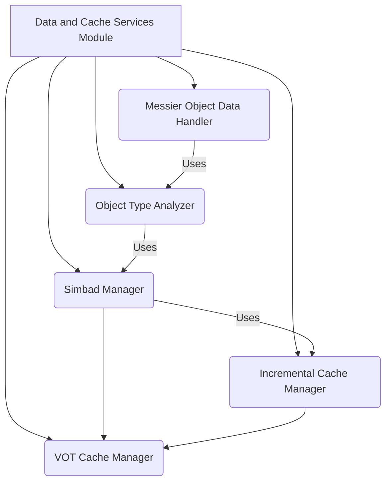

# Data and Cache Services Module

## Introduction and Purpose

The `data_and_cache_services` module is a critical component responsible for efficient data acquisition, caching, and management of astronomical object properties. It interacts with external astronomical databases like SIMBAD and VizieR, and implements robust caching mechanisms to minimize redundant queries, improve performance, and ensure data integrity. This module also provides specialized handlers for Messier objects and a comprehensive analyzer for astronomical object types, supporting research-grade statistical analysis and reporting.

## Architecture Overview

The `data_and_cache_services` module is structured into several key sub-modules, each with distinct responsibilities. These sub-modules work in concert to provide a robust and efficient data handling pipeline.

### Component Relationships:

*   **Simbad Manager** (`simbad_manager.py`): Handles all interactions with the SIMBAD astronomical database, including query configuration, rate limiting, retry logic, and result processing. It relies on the `VOT Cache Manager` for VOT file operations and interacts with the `Incremental Cache Manager` for property updates.
*   **Incremental Cache Manager** (`incremental_cache_manager.py`): Provides smart caching for VizieR catalog data (Hipparcos, Gaia) and SIMBAD properties. It supports incremental fetching, ensuring that only new or updated data is retrieved, thus optimizing API usage and data transfer. It also utilizes the `VOT Cache Manager` for VOT file handling.
*   **VOT Cache Manager** (`vot_cache_manager.py`): Specializes in the safe management of VizieR VOT (Virtual Observatory Table) cache files. It implements protection protocols, integrity checks, and atomic save operations to prevent data corruption.
*   **Messier Object Data Handler** (`messier_object_data_handler.py`): Manages the acquisition, processing, and transformation of data related to Messier objects. It calculates 3D coordinates and prepares data for visualization.
*   **Object Type Analyzer** (`object_type_analyzer.py`): Provides comprehensive analysis of astronomical object types, categorizing them, calculating diversity metrics, and generating detailed reports. It can leverage data processed by other modules, including SIMBAD results.

## High-Level Functionality of Sub-modules

*   **[Simbad Manager](simbad_manager.md)**:
    *   Configurable SIMBAD query parameters (rate limiting, timeouts, retries).
    *   Manages SIMBAD queries for individual and multiple objects.
    *   Tracks query statistics and handles error logging.
    *   Integrates with VOT cache for comprehensive data protection and rebuilding.

*   **[Incremental Cache Manager](incremental_cache_manager.md)**:
    *   Manages metadata for cached catalog data.
    *   Checks cache validity and determines if incremental fetching, filtering, or full refetch is needed.
    *   Merges existing and newly fetched data, removing duplicates.
    *   Provides smart loading and fetching for Hipparcos and Gaia data.

*   **[VOT Cache Manager](vot_cache_manager.md)**:
    *   Safely loads and saves VOT files with validation and backup mechanisms.
    *   Protects base VOT files by creating timestamped backups.
    *   Merges incremental VOT data.
    *   Rebuilds PKL properties from VOT and existing caches.

*   **[Messier Object Data Handler](messier_object_data_handler.md)**:
    *   Retrieves and filters Messier objects based on magnitude and type.
    *   Calculates 3D Cartesian coordinates for Messier objects.
    *   Transforms Messier object data into a DataFrame format compatible with stellar data for visualization.

*   **[Object Type Analyzer](object_type_analyzer.md)**:
    *   Categorizes astronomical object types into predefined categories (e.g., Variable Stars, Evolved Stars).
    *   Analyzes the distribution of object types, calculating diversity scores, Shannon entropy, and Simpson index.
    *   Identifies notable and high-interest research targets.
    *   Generates comprehensive, research-grade reports on stellar populations and data quality.
