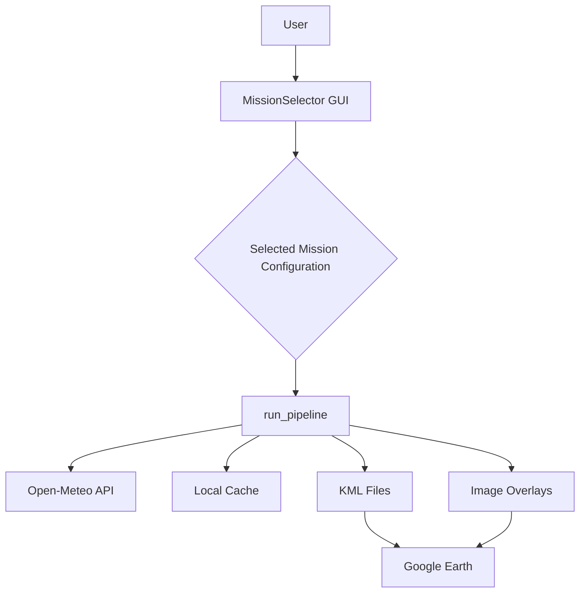

# earth_system_generator Module Documentation

## 1. Introduction

The `earth_system_generator` module is a core component of the `mission_control` system, designed to visualize and analyze heatwave scenarios across various historical and projected dates. It provides a user-friendly graphical interface for selecting a scenario and then generates comprehensive KML (Keyhole Markup Language) files for Google Earth. These KML files include detailed wet-bulb temperature "spikes," population impact layers, and interpolated heatmaps, along with informative screen overlays for legends and scenario briefings.

## 2. Core Functionality

The primary functions of the `earth_system_generator` module are:

*   **Scenario Selection:** Allows users to choose from a predefined list of heatwave events through a Tkinter-based GUI.
*   **Weather Data Retrieval:** Fetches historical hourly temperature and relative humidity data from the Open-Meteo API for the selected scenario's date and geographical range.
*   **Wet-Bulb Temperature Calculation:** Computes the wet-bulb temperature, a critical metric for assessing human heat stress, for each data point.
*   **Data Caching:** Implements a local caching mechanism to store retrieved weather data, reducing redundant API calls and improving performance.
*   **KML Generation:** Creates three distinct KML layers for Google Earth:
    *   **Spikes Layer:** Visualizes individual wet-bulb temperature data points as vertical "spikes," color-coded by risk level, with interactive pop-ups providing detailed information.
    *   **Impact Layer:** Highlights population hubs within the scenario's region as colored circles, dynamically sized by population, offering insights into human exposure.
    *   **Heatmap Layer:** Generates an interpolated thermal overlay showing the spatial distribution of wet-bulb temperatures across the region.
*   **Informational Overlays:** Produces PNG images for KML screen overlays, including a wet-bulb risk legend, a population impact legend, and a scenario-specific intelligence briefing.

## 3. Architecture

### High-Level Overview

The `earth_system_generator` module operates as a standalone application with a clear separation of concerns, as illustrated below:



### Key Components and their Roles

*   **`MissionSelector` (GUI):** A Tkinter-based class that provides the user interface for selecting a heatwave scenario. It displays scenario names, descriptions, and dates, and initiates the KML generation process upon user confirmation.
*   **`SCENARIOS` (Data Structure):** A dictionary containing the configurations for all predefined heatwave scenarios. Each entry includes geographical ranges, dates, focus values, and descriptive briefings.
*   **`POPULATION_HUBS` (Data Structure):** A dictionary mapping scenario IDs to lists of significant population centers, including their coordinates and population figures, used for the impact layer.
*   **`calculate_wet_bulb(T, RH)` (Function):** Implements the physiological model to compute the wet-bulb temperature from air temperature and relative humidity.
*   **Caching Functions (`get_cache_path`, `load_cache`, `save_cache`):** Manage the persistence of fetched weather data to a local JSON file, optimizing performance and reducing API calls.
*   **KML Generation Functions (`generate_popup_html`, `create_legend_card`, `create_intel_card`, `create_pop_legend_card`, `create_circle_polygon`):** Helper functions responsible for formatting data, generating HTML content for KML pop-ups, creating image overlays, and defining geographical shapes for KML elements.
*   **`run_pipeline(mission)` (Main Logic):** Orchestrates the entire process. It fetches data, performs calculations, generates all KML layers and image overlays, and saves them to the `data` directory.

### Dependencies

The module relies on several external and internal libraries:

*   **`requests`:** For making HTTP requests to the Open-Meteo API to retrieve weather data.
*   **`simplekml`:** A Python library for generating KML files, which are then visualized in Google Earth.
*   **`numpy`:** Utilized for numerical operations, particularly in wet-bulb temperature calculations and data interpolation.
*   **`scipy.interpolate.griddata`:** Used for interpolating sparse weather data points into a continuous grid for heatmap generation.
*   **`tkinter`, `ttk`, `messagebox`:** Python's standard GUI library, used to build the `MissionSelector` interface.
*   **`json`, `os`:** For file system operations, specifically for managing the local data cache.
*   **`textwrap`, `math`, `matplotlib.pyplot`, `matplotlib.patches`:** Used for text formatting, mathematical calculations, and generating static image files for KML screen overlays (legends and intel cards).

## 4. Component Relationships and Data Flow

### Component Interaction

The following diagram illustrates the interactions between the main components within the `earth_system_generator` module:

```mermaid
graph TD
    A[MissionSelector] --> B{Selected Scenario Config}
    B --> C[run_pipeline]
    C --> D[SCENARIOS]
    C --> E[POPULATION_HUBS]
    C --> F[get_cache_path]
    C --> G[load_cache]
    C --> H[save_cache]
    C --> I[requests (Open-Meteo API)]
    C --> J[calculate_wet_bulb]
    C --> K[generate_popup_html]
    C --> L[create_legend_card]
    C --> M[create_intel_card]
    C --> N[create_pop_legend_card]
    C --> O[create_circle_polygon]
    C --> P[simplekml]
    C --> Q[matplotlib.pyplot]
    P --> R[KML Output]
    Q --> S[PNG Overlays]
```

### Data Flow

The data flow within the module, from user input to KML output, is depicted below:

```mermaid
graph LR
    A[User Selection] --> B[MissionSelector]
    B --> C[Scenario Configuration]
    C --> D[run_pipeline]
    D -- "Date, Lat/Lon Ranges" --> E[Open-Meteo API]
    E -- "Temp, RH Data" --> F[calculate_wet_bulb]
    F -- "Wet Bulb Temps" --> G[Data Cache]
    G --> H[Interpolation (griddata)]
    H --> I[Heatmap Image]
    G --> J[KML Spikes (with Popups)]
    C -- "Population Data" --> K[KML Impact]
    L[Legend Images] --> M[KML Overlays]
    N[Intel Image] --> M
    J --> O[Google Earth]
    K --> O
    I --> O
    M --> O
```

## 5. Integration with Overall System

The `earth_system_generator` module is a child module of `mission_control`. Its role is to provide the `mission_control` system with the capability to generate detailed environmental scenarios, specifically focusing on heatwave events. The KML outputs generated by this module can be directly consumed by Google Earth, allowing operators or analysts within the `mission_control` framework to visualize and understand the spatial and temporal impacts of various heatwave scenarios. This module acts as a critical visualization and analysis tool, transforming raw meteorological data into actionable geographical intelligence for mission planning and assessment.

While this module focuses on generating KML outputs, other modules within the `mission_control` system or related modules like `reporting_and_infrastructure` might consume or further process the insights derived from these visualizations. For instance, the `report_manager` in the `reporting_and_infrastructure` module could potentially integrate data or summaries from these generated scenarios into broader reports.

## 6. Usage

To use the `earth_system_generator` module:

1.  Run the `earth_system_generator.py` script.
2.  A "Scenario Generator" GUI window will appear.
3.  Select a desired heatwave scenario from the list.
4.  Click the "GENERATE GOOGLE EARTH KML LAYER" button.
5.  The module will fetch data (if not cached), perform calculations, and generate three KML files (spikes, impact, heatmap) and associated PNG image overlays in the `data` directory.
6.  These KML files can then be opened in Google Earth to visualize the scenario.
