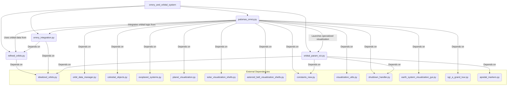

# Orrery and Orbital System Module

## Introduction
The `orrery_and_orbital_system` module is a core component responsible for calculating, refining, and visualizing the orbits of celestial bodies within the application. It integrates various orbital mechanics models, from idealized Keplerian orbits to refined ephemeris-based trajectories, and provides the foundational data for the interactive solar system visualization.

## Purpose
The primary purpose of this module is to:
*   Provide accurate positional data for planets, moons, asteroids, comets, and spacecraft.
*   Offer both idealized (Keplerian) and refined (ephemeris-corrected) orbital calculations.
*   Integrate these orbital models into the main graphical user interface (`palomas_orrery.py`).
*   Enable detailed visualization of orbital parameter transformations and eccentricity effects.

## Architecture Overview

The `orrery_and_orbital_system` module is structured into several key components that interact to provide its functionality. The `palomas_orrery.py` script acts as the central GUI, orchestrating interactions with other sub-modules for data fetching, orbital calculations, and specialized visualizations.

## Sub-modules and Core Functionality

This module comprises the following key sub-modules:

*   **[Refined Orbits](refined_orbits.md)**: Provides mechanisms for calculating and applying corrections to idealized orbits using JPL Horizons ephemeris data, offering more accurate satellite positions.
*   **[Orrery Integration](orrery_integration.md)**: Handles the integration of different orbital models (idealized and refined) into the main `palomas_orrery` application, managing orbit selection and display configurations.
*   **[Paloma's Orrery GUI](palomas_orrery.md)**: The main graphical user interface that allows users to select celestial objects, set dates, control visualization parameters, and interact with the solar system model.
*   **[Orbital Parameter Visualization](orbital_param_viz.md)**: A specialized tool for interactively visualizing the geometric transformations involved in defining an orbit from its Keplerian elements, and demonstrating the effects of eccentricity.
