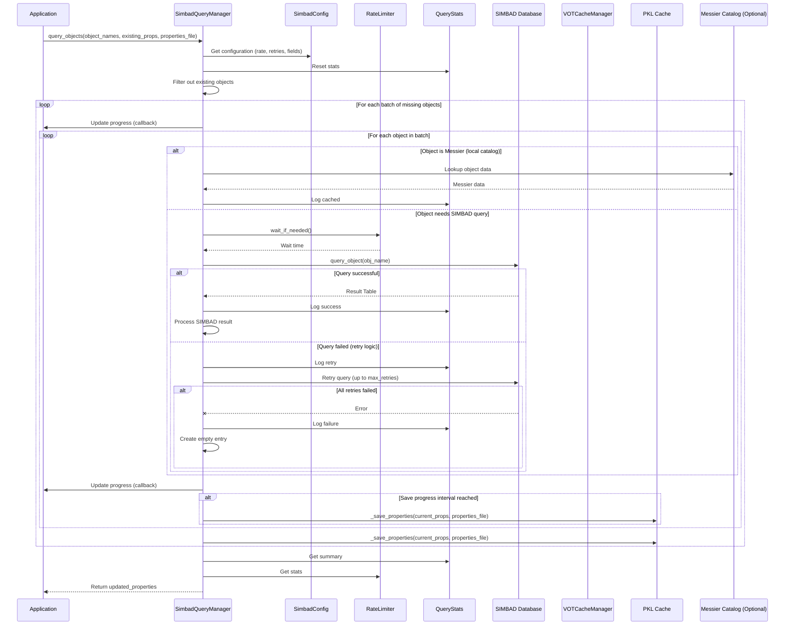
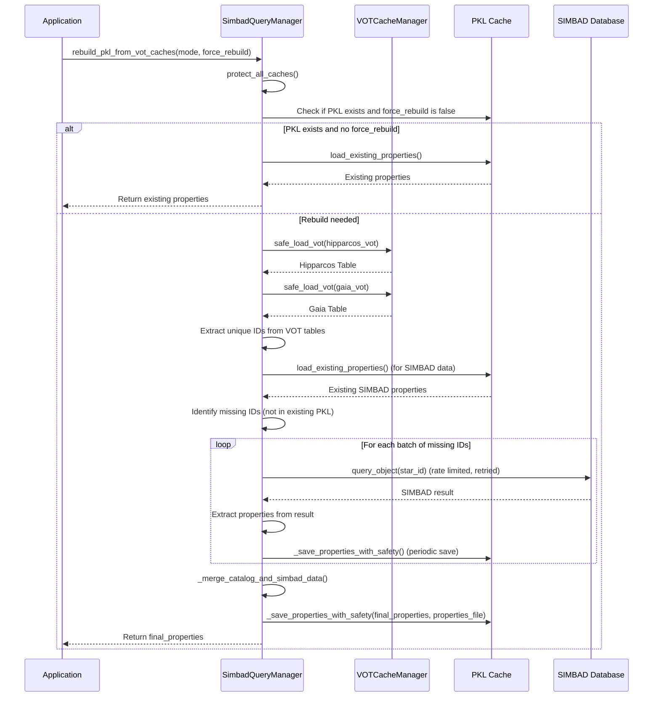
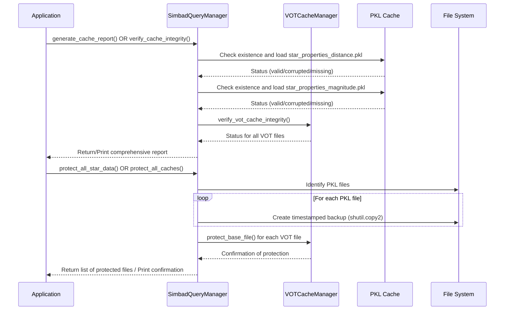
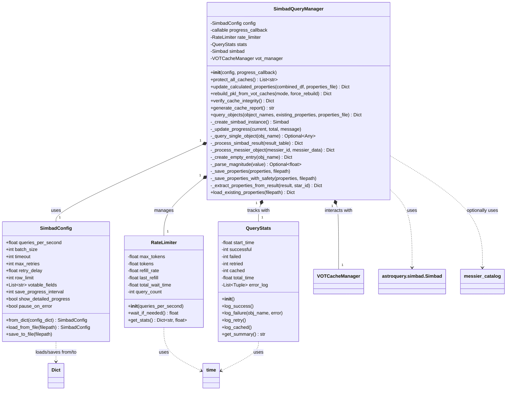

# Simbad Manager Module Documentation

## 1. Introduction

The `simbad_manager` module provides a robust and enhanced interface for querying the SIMBAD astronomical database. It includes features such as configurable rate limiting, retry logic, progress tracking, and integration with local VOTable (VOT) and pickle (PKL) caches. This module is crucial for efficiently retrieving and managing astronomical object data, ensuring reliable access to SIMBAD while respecting API usage policies.

## 2. Core Functionality and Components

The `simbad_manager` module is composed of the following core components:

### 2.1. `SimbadConfig`
A dataclass that holds all user-adjustable configuration parameters for SIMBAD queries. This includes:
-   **Rate Limiting**: `queries_per_second`, `batch_size`
-   **Timeout and Retry**: `timeout`, `max_retries`, `retry_delay`
-   **Query Configuration**: `row_limit`, `votable_fields` (fields to retrieve from SIMBAD)
-   **Progress Saving**: `save_progress_interval`
-   **User Preferences**: `show_detailed_progress`, `pause_on_error`

It also provides class methods to load and save configurations from/to a pickle file, allowing for persistent settings.

### 2.2. `RateLimiter`
Implements a token bucket algorithm to control the rate of SIMBAD queries. This prevents overwhelming the SIMBAD server and adheres to its usage policies.
-   **`__init__(queries_per_second)`**: Initializes the limiter with a specified query rate.
-   **`wait_if_needed()`**: Pauses execution if necessary to maintain the configured query rate, returning the actual wait time.
-   **`get_stats()`**: Provides statistics on queries made, total wait time, and actual query rate.

### 2.3. `QueryStats`
A utility class for tracking various statistics related to SIMBAD queries. It records:
-   Successful, failed, retried, and cached queries.
-   Start time and total elapsed time.
-   A log of errors encountered during queries.
-   **`get_summary()`**: Generates a human-readable summary of the query session.

### 2.4. `SimbadQueryManager`
The central class that orchestrates SIMBAD queries. It integrates `SimbadConfig`, `RateLimiter`, and `QueryStats` to provide a comprehensive querying solution.
-   **`__init__(config, progress_callback)`**: Initializes the manager with a `SimbadConfig` object and an optional progress callback. It also initializes an `astroquery.simbad.Simbad` instance and integrates with the `VOTCacheManager`.
-   **`protect_all_caches()`**: Creates timestamped backups of critical PKL and VOT cache files to prevent data loss.
-   **`update_calculated_properties(combined_df, properties_file)`**: Updates existing star properties (loaded from PKL) with calculated stellar parameters (e.g., Temperature, Luminosity) from a DataFrame. It includes robust safety checks to prevent accidental data loss during saving.
-   **`rebuild_pkl_from_vot_caches(mode, force_rebuild)`**: Reconstructs the main PKL properties file (`star_properties_distance.pkl` or `star_properties_magnitude.pkl`) by extracting unique IDs from VOT cache files (Hipparcos, Gaia), querying SIMBAD for missing data, and merging all information.
-   **`verify_cache_integrity()`**: Checks the integrity of both PKL and VOT cache files, reporting their status (valid, corrupted, missing) and providing a summary of issues.
-   **`generate_cache_report()`**: Creates a human-readable report detailing the status of all star data cache files.
-   **`query_objects(object_names, existing_properties, properties_file)`**: The primary method for querying a list of astronomical objects. It handles batching, rate limiting, retry logic, progress updates, and saving intermediate results to a specified properties file. It also checks for Messier objects in a local catalog before querying SIMBAD.
-   **Internal Helper Methods**: Includes methods for creating SIMBAD instances, updating progress, querying single objects with retry logic, processing SIMBAD results, handling Messier objects, creating empty entries for failed queries, parsing magnitudes, and saving/loading properties.

## 3. Architecture and Component Relationships

The `simbad_manager` module acts as a central hub for astronomical data retrieval, primarily interacting with the SIMBAD database and local cache systems.

### 3.1. Internal Relationships
-   `SimbadQueryManager` is the orchestrator. It *uses* `SimbadConfig` for its settings, *contains* a `RateLimiter` to manage query frequency, and *utilizes* `QueryStats` to track performance and errors.
-   `SimbadConfig` is a passive data holder, configured by the application or loaded from a file.
-   `RateLimiter` and `QueryStats` are active components managed by `SimbadQueryManager` during query operations.

### 3.2. External Dependencies
The `simbad_manager` module has key dependencies on other modules, particularly within the `data_and_cache_services` and potentially `messier_object_data_handler` (though the latter is an optional import).

-   **`vot_cache_manager.VOTCacheManager`**: `SimbadQueryManager` directly initializes and uses `VOTCacheManager` to manage and interact with VOTable cache files (e.g., `hipparcos_data_distance.vot`, `gaia_data_distance.vot`). This allows `simbad_manager` to rebuild its PKL properties files from these VOT caches and verify their integrity.
-   **`astroquery.simbad`**: This is the primary external library used for interacting with the SIMBAD database. `SimbadQueryManager` wraps and configures an instance of `astroquery.simbad.Simbad`.
-   **`messier_catalog` (optional)**: The `query_objects` method attempts to import `messier_catalog` and `star_cluster_catalog`. If available, it uses these local catalogs to retrieve information for Messier objects, reducing the need for SIMBAD queries for known objects. This suggests a dependency on the `messier_object_data_handler` module.

### 3.3. How it Fits into the Overall System
The `simbad_manager` module is a critical part of the `data_and_cache_services` layer. It provides the foundational data for other modules that require detailed astronomical object properties, such as:
-   **`star_visualization`**: Modules like `star_visualization_gui` would likely consume the star properties managed by `SimbadQueryManager` to display stars and their attributes.
-   **`orrery_and_orbital_system`**: While not directly querying SIMBAD, modules in this system might use the processed star data (e.g., distances, magnitudes) for calculations or visualizations.
-   **`mission_control`**: The `MissionControlApp` might indirectly rely on the data provided by `simbad_manager` for displaying information about celestial objects.

By centralizing SIMBAD interactions and robustly managing cached data, `simbad_manager` ensures that other parts of the system have efficient and reliable access to astronomical object information without needing to handle the complexities of external API interactions, rate limiting, and data persistence.

## 4. Data Flow

The data flow within the `simbad_manager` module primarily revolves around retrieving, processing, and caching astronomical object properties.

```mermaid
graph TD
    A --> Requests Star Data B(SimbadQueryManager)
    B -->|Checks Existing Properties| C{Existing PKL Cache?}
    C -- Yes --> D[Return Cached Data]
    C -- No/Missing --> E{Existing VOT Cache?}
    E -- Yes --> F[VOTCacheManager]
    F --> Loads VOTable Data G[Raw VOT Data (Hipparcos, Gaia)]
    G --> Extracts IDs & Properties B
    B -->|Identifies Missing IDs| H{SIMBAD Database}
    H -->|Queries (Rate Limited, Retried)| B
    B -->|Processes SIMBAD Results| I[Processed Star Properties]
    I -->|Merges with Catalog Data| J[Combined Star Properties]
    J -->|Updates/Saves to PKL Cache| K[PKL Cache (star_properties_*.pkl)]
    K -->|Returns Data| A
    B -->|Generates Reports| L[Cache Status Report]
    L --> A
    B -->|Protects Caches| M[Backup Files]
```

**Flow Description:**
1.  **Request**: An application component (e.g., a GUI, a data processing script) requests star properties from `SimbadQueryManager`.
2.  **PKL Cache Check**: `SimbadQueryManager` first checks its internal `existing_properties` and the main PKL cache files (`star_properties_distance.pkl`, `star_properties_magnitude.pkl`).
3.  **VOT Cache Integration**: If data is missing or a rebuild is requested, `SimbadQueryManager` interacts with `VOTCacheManager` to load data from VOTable files (e.g., Hipparcos, Gaia catalogs).
4.  **SIMBAD Query**: For any remaining missing objects, `SimbadQueryManager` queries the external SIMBAD database. This process is subject to `RateLimiter` and includes retry logic based on `SimbadConfig`.
5.  **Data Processing**: Raw results from SIMBAD are processed and standardized into a dictionary format.
6.  **Merging**: SIMBAD results are merged with data extracted from VOT caches and potentially local Messier catalogs.
7.  **PKL Cache Update**: The combined and processed star properties are then saved back to the PKL cache files, ensuring data persistence and quick access for future requests. Safety checks are performed during this save operation.
8.  **Return**: The `SimbadQueryManager` returns the complete set of star properties to the calling module.
9.  **Reporting & Protection**: `SimbadQueryManager` can also generate cache integrity reports and create backups of cache files, providing robust data management.

## 5. Process Flows

### 5.1. Querying Astronomical Objects

This flow describes how `SimbadQueryManager` handles a request to query multiple astronomical objects, incorporating caching, rate limiting, and error handling.



### 5.2. Rebuilding PKL Cache from VOT Caches

This flow details the process of reconstructing the main star properties PKL file using data from VOTable caches and supplementing with SIMBAD queries.



### 5.3. Cache Integrity Verification and Protection

This flow illustrates how `SimbadQueryManager` verifies the health of its cache files and creates backups.



## 6. Class Diagram



## 7. References

-   For detailed information on VOTable cache management, refer to the [vot_cache_manager.md](vot_cache_manager.md) documentation.
-   For details on Messier object data handling, refer to the [messier_object_data_handler.md](messier_object_data_handler.md) documentation (if available).
