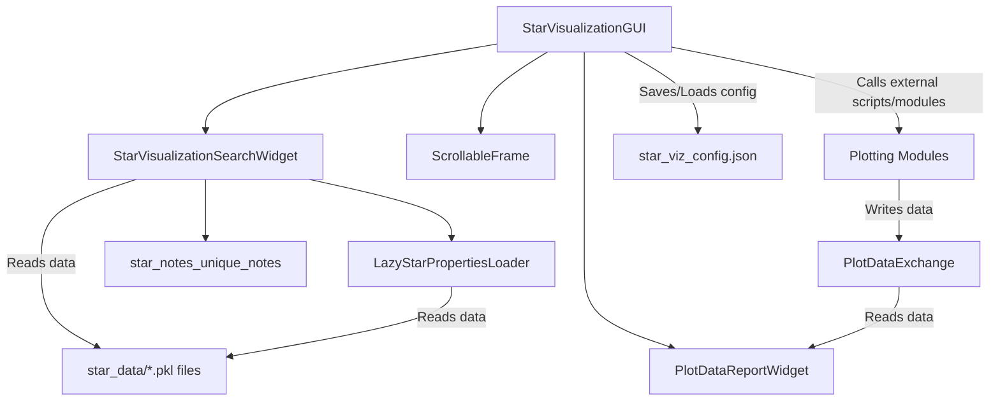
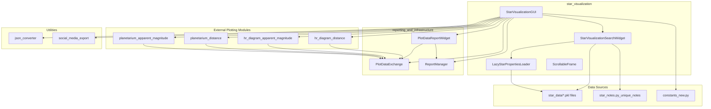

# Star Visualization Module Documentation

## 1. Introduction

The `star_visualization` module provides a comprehensive graphical user interface (GUI) for exploring and visualizing stellar data. It allows users to search for stars, view their detailed properties, and generate various astronomical plots, including 3D stellar neighborhood maps and 2D Hertzsprung-Russell (HR) diagrams, based on distance or apparent magnitude criteria. The module is designed for efficient data handling, supporting lazy loading of star properties and integration with reporting functionalities.

## 2. Core Functionality

The `star_visualization` module offers the following key functionalities:

*   **Star Search and Information Display**: Users can search for stars by name across different categories (Notable Stars, Stars by Distance, Stars by Magnitude). Detailed properties, including coordinates, physical characteristics (temperature, luminosity, magnitude), spectral type, object type, and source catalog, are displayed in a unified information panel.
*   **Lazy Data Loading**: Star properties are loaded on-demand to optimize memory usage and application startup time, especially when dealing with large datasets.
*   **3D Stellar Neighborhood Visualization**: Generates interactive 3D plots of stars within a specified distance (light-years) or based on apparent magnitude, allowing users to explore the spatial distribution of stars.
*   **2D Hertzsprung-Russell (HR) Diagram Visualization**: Creates 2D HR diagrams, plotting stellar luminosity against temperature (or spectral type), for stars within a given distance or brighter than a specified apparent magnitude.
*   **PyInstaller Support**: The application is designed to run seamlessly as a frozen executable, directly calling plotting modules when packaged.
*   **Configuration Management**: Saves and restores window geometry and sash positions for a consistent user experience across sessions.
*   **Social Media Export**: Provides a utility to convert saved 3D HTML visualizations into a portrait format suitable for social media platforms.
*   **Integration with Reporting**: Displays a summary report of the generated plots, including data statistics and processing times, leveraging components from the `reporting_and_infrastructure` module.

## 3. Architecture and Component Relationships

The `star_visualization` module is built around a set of interconnected components, primarily focusing on the GUI and data management.

### 3.1. Core Components

*   **`StarVisualizationGUI`**: This is the main application window, inheriting from `tk.Tk`. It orchestrates the entire user interface, including the search widget, visualization controls, status display, and notes panel. It manages window geometry, configuration saving/loading, and initiates the various plotting functions.
*   **`StarVisualizationSearchWidget`**: A `ttk.Frame` widget responsible for handling star search functionality. It contains search entry fields, listboxes for displaying search results, and a text widget for showing detailed star information. It interacts with `LazyStarPropertiesLoader` to fetch star data and `unique_notes` for star descriptions.
*   **`LazyStarPropertiesLoader`**: Manages the loading of star property data from pickle files (`.pkl`). It implements an on-demand loading mechanism to efficiently handle large datasets, caching loaded properties to avoid redundant file I/O. It provides methods to get properties by type and retrieve star counts.
*   **`ScrollableFrame`**: A utility `ttk.Frame` that embeds a `tk.Canvas` and a `ttk.Scrollbar` to create a scrollable area, used to manage content that might exceed the visible area, particularly in the visualization controls section.

### 3.2. Component Interaction

The `StarVisualizationGUI` acts as the central hub, instantiating and arranging the `StarVisualizationSearchWidget` and other UI elements. The `StarVisualizationSearchWidget` relies on `LazyStarPropertiesLoader` to retrieve star names for its search lists and detailed properties when a star is selected. Plotting actions triggered in the `StarVisualizationGUI` (e.g., "3D Stellar Neighborhood") invoke external plotting scripts (or direct module calls in frozen executables) and then update the `PlotDataReportWidget` with the results.

### Mermaid Diagram: Component Diagram


## 4. How the Module Fits into the Overall System

The `star_visualization` module serves as the primary user-facing component for interactive exploration of stellar data within the larger system. It integrates several data processing and reporting functionalities to provide a complete experience.

*   **Data Source**: It consumes processed star data, likely generated by other modules (e.g., `data_and_cache_services` which might be responsible for creating the `star_data/*.pkl` files from raw astronomical catalogs like SIMBAD or VOT). The `LazyStarPropertiesLoader` specifically handles these `.pkl` files.
*   **Visualization Engine**: It acts as a front-end to dedicated plotting modules (e.g., `hr_diagram_distance`, `planetarium_distance`, `hr_diagram_apparent_magnitude`, `planetarium_apparent_magnitude`). These modules are external Python scripts or directly imported modules that handle the actual generation of interactive Plotly visualizations.
*   **Reporting Integration**: It heavily relies on components from the `reporting_and_infrastructure` module:
    *   `PlotDataReportWidget`: Displays a summary of the generated plots and data statistics.
    *   `PlotDataExchange`: A mechanism for exchanging plot-related data between the visualization GUI and the reporting widget, ensuring that plot results are consistently displayed.
    *   `ReportManager`: Used to load and display comprehensive scientific reports, potentially generated by other parts of the system after a visualization.
*   **Configuration**: It manages its own configuration (`star_viz_config.json`) for GUI layout, ensuring persistence across sessions.
*   **Constants**: It uses `constants_new` for mappings like `object_type_mapping`, `class_mapping`, and `stellar_class_labels`, which are crucial for interpreting and displaying star properties.

### Mermaid Diagram: Module Dependencies


### Mermaid Diagram: Data Flow for Visualization
```mermaid
graph LR
    subgraph User Interaction
        A[User Input: Distance/Magnitude] --> B{StarVisualizationGUI}
        C[User Input: Star Search] --> D{StarVisualizationSearchWidget}
    end

    subgraph Data Loading & Processing
        D --> E[LazyStarPropertiesLoader]
        E --> F[star_data/*.pkl files]
        F -- Star Names & Basic Props --> D
        F -- Full Star Properties --> D
        D --> G[unique_notes.py]
        G -- Star Descriptions --> D
        B -- Visualization Parameters --> H[Plotting Modules]
        H -- Processes Data --> I[Generated Plot Data]
    end

    subgraph Output & Reporting
        I -- Writes to --> J[PlotDataExchange]
        J -- Reads by --> K[PlotDataReportWidget]
        K --> L[Display Report in GUI]
        H -- Generates --> M[Interactive HTML Plot]
        M --> N[Web Browser Display]
        B -- Triggers --> O[ReportManager (Load Last Report)]
        O -- Reads from --> P[reports/*.json]
        P -- Displayed by --> K
    end

    subgraph Social Media Export
        Q[User Selects HTML File] --> R{StarVisualizationGUI}
        R --> S[json_converter (Extract Plotly JSON)]
        S --> T[Plotly Figure Object]
        T --> U[social_media_export (Generate Social HTML)]
        U --> V[Social Media HTML File]
        V --> N
    end
```

### Mermaid Diagram: Process Flow for Generating a 3D Stellar Neighborhood Plot
```mermaid
graph TD
    A[User Enters Distance (ly) in GUI] --> B{StarVisualizationGUI.plot_3d_distance()}
    B -- Validates Input --> C{Input Valid?}
    C -- No --> D[Display Error Status]
    C -- Yes --> E[Update Status: "Generating 3D visualization..."]
    E --> F{Is Application Frozen (PyInstaller)?}
    F -- Yes --> G[Directly Call planetarium_distance.main()]
    F -- No --> H[Execute planetarium_distance.py via Subprocess]
    G --> I[planetarium_distance Module Executes]
    H --> I
    I -- Generates Plot Data --> J[Plotly HTML File]
    I -- Writes Summary Data --> K[PlotDataExchange]
    I -- Writes Scientific Report --> L[ReportManager]
    J --> M[Opens in Web Browser]
    K --> N[PlotDataReportWidget.update_report()]
    L --> O[PlotDataReportWidget.display_report()]
    N --> P[Display Plot Summary in GUI]
    O --> P
    I -- Success --> Q[Update Status: "Launched 3D plot..."]
    I -- Failure --> R[Update Status: "Error generating 3D plot"]
```
