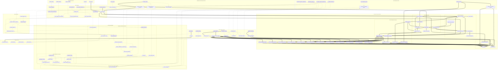

```mermaid
flowchart TD
 subgraph subGraph7["External Data Sources"]
        HORIZONS{{"JPL Horizons"}}
        HIPPARCOS{{"Hipparcos Catalog"}}
        GAIA{{"Gaia DR3"}}
        SIMBAD{{"SIMBAD Database"}}
        MESSCAT{{"Messier Catalog"}}
 end
 
 subgraph subGraph2["Data Acquisition"]
        DA(["data_acquisition.py"])
        DAD(["data_acquisition_distance.py"])
        ODM(["orbit_data_manager.py"])
        SP(["star_properties.py"])
        MESS(["messier_object_data_handler.py"])
        MESSDATA(["messier_catalog.py"])
        VIZIER[/"initialize_vizier"\]
        LOADHIP[/"load_or_fetch_hipparcos_data"\]
        LOADGAIA[/"load_or_fetch_gaia_data"\]
        FETCHORB[/"fetch_orbit_path"\]
        QUERYSIMBAD[/"query_simbad_for_star_properties"\]
 end
 
 subgraph subGraph8["Data Processing"]
        DP(["data_processing.py"])
        CALCCOORDS[/"calculate_cartesian_coordinates"\]
        GENUID[/"generate_unique_ids"\]
        ASSIGNPROPS[/"assign_properties_to_data"\]
        CONVERTMESS[/"convert_messier_to_df"\]
 end
 
 subgraph subGraphSolar["🌟 SOLAR SYSTEM PIPELINE"]
     subgraph subGraph4["Orbit Data Management"]
            CACHE[/"load/save_orbit_paths"\]
            PRUNE[/"prune_old_data"\]
            PLANET9[/"calculate_planet9_orbit"\]
            EPHEMDB[("`satellite_ephemerides.json`")]
            REFINEDSYS[/"RefinedOrbitSystem"\]
            ORBITCACHE[/"orbit_cache management"\]
     end
     
     subgraph subGraph13["Refined Orbit System"]
            REFINED(["refined_orbits.py"])
            INTEGRATION(["orrery_integration.py"])
            CONFIG[/"OrreryConfiguration"\]
            GETORBIT[/"get_orbit_function"\]
            CREATEREF[/"create_refined_orbit"\]
            VALIDATE[/"validate_orbit_accuracy"\]
            LOADEPHM[/"load_ephemeris_data"\]
     end
     
     subgraph subGraph10Solar["Solar Visualization Processing"]
            G(["planet_visualization.py"])
            G2(["solar_visualization_shells.py"])
            G3(["idealized_orbits.py"])
            HELPERS(["palomas_orrery_helpers.py"])
            CREATEPLANET[/"create_planet_visualization"\]
            PLOTIDEALIZED[/"plot_idealized_orbits"\]
     end

     subgraph subGraph12Solar["Planetary Shell Modules"]
            MERCURY_SHELLS(["mercury_visualization_shells.py"])
            VENUS_SHELLS(["venus_visualization_shells.py"])
            EARTH_SHELLS(["earth_visualization_shells.py"])
            MOON_SHELLS(["moon_visualization_shells.py"])
            MARS_SHELLS(["mars_visualization_shells.py"])
            JUPITER_SHELLS(["jupiter_visualization_shells.py"])
            SATURN_SHELLS(["saturn_visualization_shells.py"])
            URANUS_SHELLS(["uranus_visualization_shells.py"])
            NEPTUNE_SHELLS(["neptune_visualization_shells.py"])
            PLUTO_SHELLS(["pluto_visualization_shells.py"])
            ERIS_SHELLS(["eris_visualization_shells.py"])
            PLANET9_SHELLS(["planet9_visualization_shells.py"])
     end
     
     subgraph subGraph11Solar["Solar Plot Functions (FINAL OUTPUTS)"]
            PLOTOBJECTS[/"plot_objects"\]
            ANIMATEOBJECTS[/"animate_objects"\]
            PLOTENHANCED[/"plot_objects_enhanced"\]
     end
 end
 
 subgraph subGraphStellar["⭐ STELLAR PIPELINE"]
     subgraph subGraph9["Parameter Calculation & Selection"]
            STEL(["stellar_parameters.py"])
            CS(["catalog_selection.py"])
            SELECTSTARS[/"select_stars"\]
            CALCTEMP[/"calculate_stellar_parameters"\]
            TEMPSPECTRAL[/"estimate_temperature_from_spectral_type"\]
            TEMPBV[/"calculate_bv_temperature"\]
            SELECTTEMP[/"select_best_temperature"\]
            LUMLEST[/"luminosity_estimation"\]
            PARSECLASSES[/"parse_stellar_classes"\]
            LOADPROPS[/"load_existing_properties"\]
            SAVEPROPS[/"save_properties_to_file"\]
     end
     
     subgraph subGraph10Stellar["Stellar Visualization Processing"]
            VIZ3D(["visualization_3d.py"])
            VIZ2D(["visualization_2d.py"])
            VIZCORE(["visualization_core.py"])
            PREPARE3D[/"prepare_3d_data"\]
            PREPARE2D[/"prepare_2d_data"\]
            HOVERTEXT[/"format_detailed_hover_text"\]
            NOTABLELIST[/"create_notable_stars_list"\]
            TEMPCOLORS[/"prepare_temperature_colors"\]
     end
     
     subgraph subGraph11Stellar["Stellar Plot Functions (FINAL OUTPUTS)"]
            CREATE3D[/"create_3d_visualization"\]
            CREATEHR[/"create_hr_diagram"\]
     end
 end
 
 subgraph subGraph0["User Applications & GUIs"]
        A(["palomas_orrery.py"])
        A2(["star_visualization_gui.py"])
        PM(["planetarium_apparent_magnitude.py"])
        PD(["planetarium_distance.py"])
        HRD(["hr_diagram_distance.py"])
        HRM(["hr_diagram_apparent_magnitude.py"])
        B["Tkinter GUI & Animation Controls"]
        B2["Star Search & Clipboard Support"]
 end
 
 subgraph subGraph5["Configuration & Educational Content"]
        H(["constants_new.py"])
        SN(["star_notes.py"])
        OBJMAP[/"object_type_mapping"\]
        STELLARPARAMS[/"stellar parameters & classifications"\]
        PHYSCONST[/"physical constants & conversions"\]
        NOTEDICT[/"unique_notes dictionary"\]
 end
 
 subgraph subGraph6["Utility & Support Systems"]
        F(["formatting_utils.py"])
        I(["visualization_utils.py"])
        J(["save_utils.py"])
        K(["shutdown_handler.py"])
        SHARED(["shared_utilities.py"])
        FMTFLOAT[/"format_maybe_float"\]
        FMTHOVER[/"format_hover_text"\]
        SAVEPNG[/"save_plot"\]
        CLEANUP[/"PlotlyShutdownHandler"\]
        STARSEARCH[/"StarSearchFrame"\]
        SCROLLFRAME[/"ScrollableFrame"\]
        TOOLTIP[/"CreateToolTip"\]
        CLIPBOARD[/"add_clipboard_support"\]
        SUNDIR[/"create_sun_direction_indicator"\]
 end
 
 subgraph subGraphOutputs["📁 FINAL OUTPUTS"]
        PNGFILES[/"PNG/HTML Plot Files"\]
        JSONFILES[/"JSON Data Files"\]
        VOTFILES[/"VOTable (.vot) Files"\]
        PKLFILES[/"Pickle (.pkl) Files"\]
 end

    %% SOLAR SYSTEM PIPELINE FLOWS (THICK SOLID ARROWS)
    HORIZONS ==> FETCHORB
    ODM ==> FETCHORB
    FETCHORB ==> CACHE
    FETCHORB ==> PRUNE
    FETCHORB ==> PLANET9
    CACHE ==> G
    CACHE ==> G2
    CACHE ==> G3
    CACHE ==> REFINED
    PLANET9 ==> G
    
    %% REFINED ORBIT SYSTEM FLOWS
    EPHEMDB ==> LOADEPHM
    LOADEPHM ==> REFINEDSYS
    REFINEDSYS ==> ORBITCACHE
    REFINED ==> REFINEDSYS
    REFINED ==> CREATEREF
    REFINED ==> VALIDATE
    INTEGRATION ==> CONFIG
    INTEGRATION ==> GETORBIT
    CONFIG ==> GETORBIT
    GETORBIT ==> CREATEREF
    G3 ==> REFINED
    CREATEREF ==> G
    CREATEREF ==> G2
    CREATEREF ==> G3
    
    G ==> CREATEPLANET
    G2 ==> CREATEPLANET
    G3 ==> PLOTIDEALIZED
    CREATEPLANET ==> PLOTOBJECTS
    CREATEPLANET ==> ANIMATEOBJECTS
    PLOTIDEALIZED ==> PLOTOBJECTS
    PLOTIDEALIZED ==> ANIMATEOBJECTS
    INTEGRATION ==> PLOTENHANCED
    PLOTENHANCED ==> PLOTOBJECTS
    PLOTENHANCED ==> ANIMATEOBJECTS
    
    %% Solar GUI controls
    A ==> B
    A ==> HELPERS
    A ==> INTEGRATION
    HELPERS ==> PLOTOBJECTS
    HELPERS ==> ANIMATEOBJECTS
    B ==> PLOTOBJECTS
    B ==> ANIMATEOBJECTS
    %% Planetary shell integration
    G ==> MERCURY_SHELLS
    G ==> VENUS_SHELLS
    G ==> EARTH_SHELLS
    G ==> MOON_SHELLS
    G ==> MARS_SHELLS
    G ==> JUPITER_SHELLS
    G ==> SATURN_SHELLS
    G ==> URANUS_SHELLS
    G ==> NEPTUNE_SHELLS
    G ==> PLUTO_SHELLS
    G ==> ERIS_SHELLS
    G ==> PLANET9_SHELLS
    MERCURY_SHELLS ==> PLOTOBJECTS
    VENUS_SHELLS ==> PLOTOBJECTS
    EARTH_SHELLS ==> PLOTOBJECTS
    MOON_SHELLS ==> PLOTOBJECTS
    MARS_SHELLS ==> PLOTOBJECTS
    JUPITER_SHELLS ==> PLOTOBJECTS
    SATURN_SHELLS ==> PLOTOBJECTS
    URANUS_SHELLS ==> PLOTOBJECTS
    NEPTUNE_SHELLS ==> PLOTOBJECTS
    PLUTO_SHELLS ==> PLOTOBJECTS
    ERIS_SHELLS ==> PLOTOBJECTS
    PLANET9_SHELLS ==> PLOTOBJECTS
    %% Shared utilities to planetary shells
    SHARED ==> SUNDIR
    SUNDIR ==> MERCURY_SHELLS
    SUNDIR ==> VENUS_SHELLS
    SUNDIR ==> EARTH_SHELLS
    SUNDIR ==> MOON_SHELLS
    SUNDIR ==> MARS_SHELLS
    SUNDIR ==> JUPITER_SHELLS
    SUNDIR ==> SATURN_SHELLS
    SUNDIR ==> URANUS_SHELLS
    SUNDIR ==> NEPTUNE_SHELLS
    SUNDIR ==> PLUTO_SHELLS
    SUNDIR ==> ERIS_SHELLS
    SUNDIR ==> PLANET9_SHELLS
    %% Solar utilities from modules
    H ==> PHYSCONST
    PHYSCONST ==> FETCHORB
    PHYSCONST ==> REFINED
    I ==> FMTHOVER
    FMTHOVER ==> PLOTOBJECTS
    K ==> CLEANUP
    CLEANUP ==> PLOTOBJECTS
    CLEANUP ==> ANIMATEOBJECTS
    J ==> SAVEPNG
    SAVEPNG ==> PNGFILES
    
    %% STELLAR PIPELINE FLOWS (DASHED ARROWS)
    HIPPARCOS -.-> LOADHIP
    GAIA -.-> LOADGAIA
    SIMBAD -.-> QUERYSIMBAD
    MESSCAT -.-> MESSDATA
    MESSDATA -.-> MESS
    DA -.-> VIZIER
    DAD -.-> VIZIER
    VIZIER -.-> LOADHIP
    VIZIER -.-> LOADGAIA
    LOADHIP -.-> CALCCOORDS
    LOADGAIA -.-> CALCCOORDS
    SP -.-> QUERYSIMBAD
    QUERYSIMBAD -.-> ASSIGNPROPS
    MESS -.-> CONVERTMESS
    CALCCOORDS -.-> STEL
    CALCCOORDS -.-> CS
    CONVERTMESS -.-> DP
    DP -.-> STEL
    DP -.-> CS
    DP -.-> GENUID
    GENUID -.-> ASSIGNPROPS
    ASSIGNPROPS -.-> STEL
    STEL -.-> CALCTEMP
    CALCTEMP -.-> TEMPSPECTRAL
    CALCTEMP -.-> TEMPBV
    TEMPSPECTRAL -.-> SELECTTEMP
    TEMPBV -.-> SELECTTEMP
    SELECTTEMP -.-> LUMLEST
    CS -.-> SELECTSTARS
    SP -.-> LOADPROPS
    LOADPROPS -.-> ASSIGNPROPS
    SP -.-> SAVEPROPS
    ASSIGNPROPS -.-> SAVEPROPS
    LUMLEST -.-> PREPARE3D
    LUMLEST -.-> PREPARE2D
    SELECTSTARS -.-> PREPARE3D
    SELECTSTARS -.-> PREPARE2D
    PARSECLASSES -.-> PREPARE3D
    PARSECLASSES -.-> PREPARE2D
    VIZ3D -.-> PREPARE3D
    VIZ3D -.-> HOVERTEXT
    VIZ3D -.-> NOTABLELIST
    VIZ2D -.-> PREPARE2D
    VIZ2D -.-> TEMPCOLORS
    VIZCORE -.-> HOVERTEXT
    PREPARE3D -.-> HOVERTEXT
    PREPARE3D -.-> NOTABLELIST
    PREPARE2D -.-> TEMPCOLORS
    HOVERTEXT -.-> CREATE3D
    NOTABLELIST -.-> CREATE3D
    TEMPCOLORS -.-> CREATEHR
    VIZ3D -.-> CREATE3D
    VIZ2D -.-> CREATEHR
    %% Stellar GUI controls
    A2 -.-> B2
    B2 -.-> CREATE3D
    PM -.-> CREATE3D
    PD -.-> CREATE3D
    HRD -.-> CREATEHR
    HRM -.-> CREATEHR
    %% Stellar utilities and configuration from modules
    H -.-> OBJMAP
    H -.-> STELLARPARAMS
    H -.-> PHYSCONST
    SN -.-> NOTEDICT
    OBJMAP -.-> PARSECLASSES
    STELLARPARAMS -.-> TEMPSPECTRAL
    NOTEDICT -.-> HOVERTEXT
    PHYSCONST -.-> CALCCOORDS
    PHYSCONST -.-> CALCTEMP
    PHYSCONST -.-> LUMLEST
    F -.-> FMTFLOAT
    FMTFLOAT -.-> HOVERTEXT
    I -.-> FMTHOVER
    FMTHOVER -.-> CREATE3D
    K -.-> CLEANUP
    CLEANUP -.-> CREATE3D
    CLEANUP -.-> CREATEHR
    I -.-> SCROLLFRAME
    I -.-> TOOLTIP
    I -.-> CLIPBOARD
    SCROLLFRAME -.-> B2
    TOOLTIP -.-> B2
    CLIPBOARD -.-> B2
    B2 -.-> STARSEARCH
    STARSEARCH -.-> SCROLLFRAME
    STARSEARCH -.-> TOOLTIP
    STARSEARCH -.-> CLIPBOARD
    PM -.-> DA
    PM -.-> MESS
    PD -.-> DAD
    HRD -.-> DAD
    HRM -.-> DA
    %% Stellar data outputs from modules
    J -.-> SAVEPROPS
    SAVEPROPS -.-> JSONFILES
    SAVEPROPS -.-> VOTFILES
    SAVEPROPS -.-> PKLFILES
```